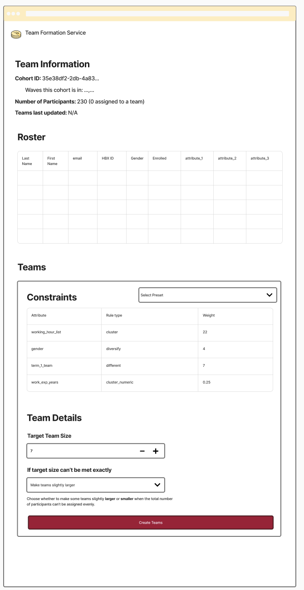

# Team Formation User Interface

A modern web interface for the Team Formation Service that enables interactive team assignment using constraint-based optimization. Built with Vue 3, Vuetify 3, and TypeScript.

## Features

- **CSV Upload**: Drag-and-drop or file selector for participant roster upload
- **Dynamic Constraint Management**: Create, edit, and validate constraints with real-time feedback
- **Preset System**: Save and load constraint configurations for reuse
- **Real-time Progress Tracking**: Server-Sent Events (SSE) streaming of optimization progress
- **Interactive Results**: View team assignments with grouping, filtering, and export capabilities
- **Data Visualization**: Charts and graphs showing team composition and distribution
- **Responsive Design**: Works on desktop, tablet, and mobile devices

## Tech Stack

- **Framework**: Vue 3 with Composition API
- **UI Library**: Vuetify 3 (Material Design)
- **State Management**: Pinia
- **Build Tool**: Vite
- **Language**: TypeScript
- **Charts**: Chart.js with vue-chartjs
- **CSV Parsing**: PapaParse
- **SSE Client**: @microsoft/fetch-event-source

## Getting Started

### Prerequisites

- Node.js 18+
- npm or yarn
- Team Formation API running on `http://localhost:8000` (or configure via environment variable)

### Installation

```bash
cd ui
npm install
```

### Development

Start the development server:

```bash
npm run dev
```

The UI will be available at `http://localhost:3000`

### Build for Production

```bash
npm run build
```

Built files will be in the `dist/` directory.

### Preview Production Build

```bash
npm run preview
```

## Configuration

Create a `.env` file in the `ui/` directory:

```env
VITE_API_BASE_URL=http://localhost:8000
```

The default API URL is `http://localhost:8000` if not specified.

## Workflow

1. **Upload Participant Roster**: Upload a CSV file with participant data
2. **View Roster**: Inspect the loaded participants in an interactive table
3. **Define Constraints**: Add constraints based on participant attributes
   - Choose attribute (column from CSV)
   - Select constraint type (cluster, cluster_numeric, different, diversify)
   - Set weight (priority)
4. **Configure Team Settings**:
   - Target team size
   - Size flexibility (larger or smaller teams when needed)
   - Maximum search time
5. **Create Teams**: Click "Create Teams" to invoke the API
6. **Monitor Progress**: Watch real-time optimization updates via SSE
7. **View Results**: Explore team assignments with visualizations
8. **Export**: Download results as CSV or JSON

## Constraint Types

- **cluster**: Group participants with shared discrete attribute values
- **cluster_numeric**: Minimize numeric attribute ranges within teams
- **different**: Ensure teams don't share specific attribute values
- **diversify**: Match team attribute distributions to overall population

## Project Structure

```
ui/
├── src/
│   ├── components/           # Vue components
│   │   ├── FileUpload.vue
│   │   ├── RosterTable.vue
│   │   ├── ConstraintManager.vue
│   │   ├── PresetManager.vue
│   │   ├── TeamSettings.vue
│   │   ├── ProgressStream.vue
│   │   ├── ResultsTable.vue
│   │   ├── TeamVisualization.vue
│   │   ├── TeamInformation.vue
│   │   ├── RosterSection.vue
│   │   └── TeamsSection.vue
│   ├── stores/               # Pinia stores
│   │   └── teamFormation.ts
│   ├── services/             # API and utilities
│   │   ├── api.ts
│   │   └── csvParser.ts
│   ├── types/                # TypeScript definitions
│   │   └── index.ts
│   ├── App.vue               # Root component
│   └── main.ts               # Application entry point
├── package.json
├── vite.config.ts
├── tsconfig.json
└── README.md
```

## Key Features Detail

### Preset Management

Save frequently used constraint configurations:
1. Configure constraints and team settings
2. Click "Presets" → "Save Current"
3. Name your preset
4. Load saved presets anytime

Presets are stored in browser localStorage.

### Real-time Progress

The API streams progress updates during optimization:
- Solution count
- Objective value (constraint satisfaction score)
- Time elapsed
- Number of conflicts

### Data Validation

The UI validates:
- CSV file format and structure
- Constraint attributes exist in participant data
- Weights are positive numbers
- Team size is greater than 2
- Required fields are present

### Export Options

Export team assignments in multiple formats:
- **CSV**: Compatible with Excel, Google Sheets
- **JSON**: For programmatic processing

## UI Wireframe



## API Integration

The UI connects to the Team Formation FastAPI backend:

**Endpoint**: `POST /assign_teams`

**Request**:
```json
{
  "participants": [...],
  "constraints": [...],
  "target_team_size": 7,
  "less_than_target": false,
  "max_time": 60
}
```

**Response**: Server-Sent Events stream with progress updates and final results

See the main project README for API documentation.

## Browser Support

- Chrome/Edge 90+
- Firefox 88+
- Safari 14+

## Troubleshooting

### API Connection Issues

If the UI cannot connect to the API:
1. Verify the API is running: `curl http://localhost:8000/health`
2. Check CORS settings in the API
3. Verify the `VITE_API_BASE_URL` environment variable

### Build Issues

If you encounter build errors:
```bash
rm -rf node_modules package-lock.json
npm install
npm run build
```

### SSE Connection Drops

If progress updates stop:
- Check browser console for errors
- Verify network connectivity
- Ensure the API process hasn't crashed
- Try reducing `max_time` to complete faster

## Development

### Adding New Components

1. Create component in `src/components/`
2. Import in parent component or section wrapper
3. Add to Pinia store if state management needed

### Modifying State

All application state is managed in `src/stores/teamFormation.ts`. Use the store methods to update state reactively.

### Testing

To test with sample data, use CSV files from the parent project's `tests/data/` directory.

## License

See parent project LICENSE file.


